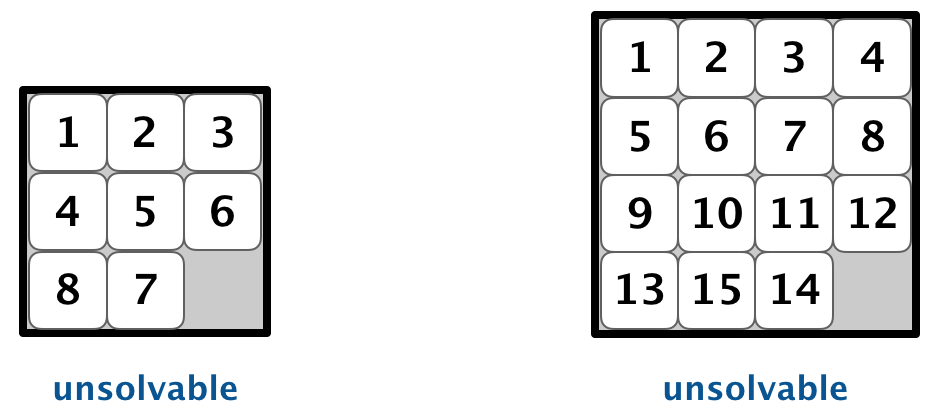

# Programming Assignment 4: Slider Puzzle

## How to compile and run

    $ javac -cp ../lib/*  
    $ java -cp ../lib/* 

## Original link

https://coursera.cs.princeton.edu/algs4/assignments/8puzzle/specification.php

## Assignment

Write a program to solve the 8-puzzle problem (and its natural generalizations) using the A\* search algorithm.

**The problem.** The [8-puzzle](http://en.wikipedia.org/wiki/Fifteen_puzzle) is a sliding puzzle that is played on a 3-by-3 grid with 8 square tiles labeled 1 through 8, plus a blank square. The goal is to rearrange the tiles so that they are in row-major order, using as few moves as possible. You are permitted to slide tiles either horizontally or vertically into the blank square. The following diagram shows a sequence of moves from an _initial board_ (left) to the _goal board_ (right).

**Board data type.** To begin, create a data type that models an _n_\-by-_n_ board with sliding tiles. Implement an immutable data type `Board` with the following API:

> public class Board {
>
>     // create a board from an n-by-n array of tiles,
>     // where tiles\[row\]\[col\] = tile at (row, col)
>     public Board(int\[\]\[\] tiles)
>                                            
>     // string representation of this board
>     public String toString()
>
>     // board dimension n
>     public int dimension()
>
>     // number of tiles out of place
>     public int hamming()
>
>     // sum of Manhattan distances between tiles and goal
>     public int manhattan()
>
>     // is this board the goal board?
>     public boolean isGoal()
>
>     // does this board equal y?
>     public boolean equals(Object y)
>
>     // all neighboring boards
>     public Iterable<Board> neighbors()
>
>     // a board that is obtained by exchanging any pair of tiles
>     public Board twin()
>
>     // unit testing (not graded)
>     public static void main(String\[\] args)
>
> }

_Constructor._  You may assume that the constructor receives an _n_\-by-_n_ array containing the _n_2 integers between 0 and _n_2 − 1, where 0 represents the blank square. You may also assume that 2 ≤ _n_ < 128.

_String representation._  The `toString()` method returns a string composed of _n_ + 1 lines. The first line contains the board size _n_; the remaining _n_ lines contains the _n_\-by-_n_ grid of tiles in row-major order, using 0 to designate the blank square.

_Hamming and Manhattan distances._  To measure how close a board is to the goal board, we define two notions of distance. The _Hamming distance_ betweeen a board and the goal board is the number of tiles in the wrong position. The _Manhattan distance_ between a board and the goal board is the sum of the Manhattan distances (sum of the vertical and horizontal distance) from the tiles to their goal positions.

_Comparing two boards for equality._  Two boards are equal if they are have the same size and their corresponding tiles are in the same positions. The `equals()` method is inherited from `java.lang.Object`, so it must obey all of Java’s requirements.

_Neighboring boards._  The `neighbors()` method returns an iterable containing the neighbors of the board. Depending on the location of the blank square, a board can have 2, 3, or 4 neighbors.

_Unit testing._  Your `main()` method should call each public method directly and help verify that they works as prescribed (e.g., by printing results to standard output).

_Performance requirements._  Your implementation should support all `Board` methods in time proportional to _n_2 (or better) in the worst case.

**A\* search.** Now, we describe a solution to the 8-puzzle problem that illustrates a general artificial intelligence methodology known as the [A\* search algorithm](http://en.wikipedia.org/wiki/A*_search_algorithm). We define a _search node_ of the game to be a board, the number of moves made to reach the board, and the previous search node. First, insert the initial search node (the initial board, 0 moves, and a null previous search node) into a priority queue. Then, delete from the priority queue the search node with the minimum priority, and insert onto the priority queue all neighboring search nodes (those that can be reached in one move from the dequeued search node). Repeat this procedure until the search node dequeued corresponds to the goal board.

The efficacy of this approach hinges on the choice of _priority function_ for a search node. We consider two priority functions:

*   The _Hamming priority function_ is the Hamming distance of a board plus the number of moves made so far to get to the search node. Intuitively, a search node with a small number of tiles in the wrong position is close to the goal, and we prefer a search node if has been reached using a small number of moves.

*   The _Manhattan priority function_ is the Manhattan distance of a board plus the number of moves made so far to get to the search node.

To solve the puzzle from a given search node on the priority queue, the total number of moves we need to make (including those already made) is at least its priority, using either the Hamming or Manhattan priority function. Why? Consequently, when the goal board is dequeued, we have discovered not only a sequence of moves from the initial board to the goal board, but one that makes the _fewest_ moves. (Challenge for the mathematically inclined: prove this fact.)

**Game tree.** One way to view the computation is as a _game tree_, where each search node is a node in the game tree and the children of a node correspond to its neighboring search nodes. The root of the game tree is the initial search node; the internal nodes have already been processed; the leaf nodes are maintained in a _priority queue_; at each step, the A\* algorithm removes the node with the smallest priority from the priority queue and processes it (by adding its children to both the game tree and the priority queue).

For example, the following diagram illustrates the game tree after each of the first three steps of running the A\* search algorithm on a 3-by-3 puzzle using the Manhattan priority function.

**Solver data type.** In this part, you will implement A\* search to solve _n_\-by-_n_ slider puzzles. Create an immutable data type `Solver` with the following API:

> public class Solver {
>
>     // find a solution to the initial board (using the A\* algorithm)
>     public Solver(Board initial)
>
>     // is the initial board solvable? (see below)
>     public boolean isSolvable()
>
>     // min number of moves to solve initial board; -1 if unsolvable
>     public int moves()
>
>     // sequence of boards in a shortest solution; null if unsolvable
>     public Iterable<Board> solution()
>
>     // test client (see below) 
>     public static void main(String\[\] args)
>
> }

_Implementation requirement._  To implement the A\* algorithm, you must use the [`MinPQ`](https://algs4.cs.princeton.edu/code/javadoc/edu/princeton/cs/algs4/MinPQ.html) data type for the priority queue.

_Corner cases._

*   Throw an `IllegalArgumentException` in the constructor if the argument is `null`.

*   Return `-1` in `moves()` if the board is unsolvable.

*   Return `null` in `solution()` if the board is unsolvable.

_Test client._ The following test client takes the name of an input file as a command-line argument and prints the minimum number of moves to solve the puzzle and a corresponding solution.

> public static void main(String\[\] args) {
>
>     // create initial board from file
>     In in = new In(args\[0\]);
>     int n = in.readInt();
>     int\[\]\[\] tiles = new int\[n\]\[n\];
>     for (int i = 0; i < n; i++)
>         for (int j = 0; j < n; j++)
>             tiles\[i\]\[j\] = in.readInt();
>     Board initial = new Board(tiles);
>
>     // solve the puzzle
>     Solver solver = new Solver(initial);
>
>     // print solution to standard output
>     if (!solver.isSolvable())
>         StdOut.println("No solution possible");
>     else {
>         StdOut.println("Minimum number of moves = " + solver.moves());
>         for (Board board : solver.solution())
>             StdOut.println(board);
>     }
> }

The input file contains the board size _n_, followed by the _n_\-by-_n_ grid of tiles, using 0 to designate the blank square.

~/Desktop/8puzzle> cat puzzle04.txt
3
0  1  3
4  2  5
7  8  6

~/Desktop/8puzzle> java-algs4 Solver puzzle04.txt
Minimum number of moves = 4

3
0  1  3
4  2  5
7  8  6

3
1  0  3
4  2  5
7  8  6

3
1  2  3
4  0  5
7  8  6

3
1  2  3
4  5  0   
7  8  6

3
1  2  3
4  5  6
7  8  0

~/Desktop/8puzzle> cat puzzle3x3-unsolvable.txt
3
1  2  3
4  5  6
8  7  0

~/Desktop/8puzzle> java-algs4 Solver puzzle3x3-unsolvable.txt
Unsolvable puzzle

**Two optimizations.** To speed up your solver, implement the following two optimizations:

*   _The critical optimization._ A\* search has one annoying feature: search nodes corresponding to the same board are enqueued on the priority queue many times (e.g., the bottom-left search node in the game-tree diagram above). To reduce unnecessary exploration of useless search nodes, when considering the neighbors of a search node, don’t enqueue a neighbor if its board is the same as the board of the previous search node in the game tree.

    

*   _Caching the Hamming and Manhattan priorities._ To avoid recomputing the Manhattan priority of a search node from scratch each time during various priority queue operations, pre-compute its value when you construct the search node; save it in an instance variable; and return the saved value as needed. This caching technique is broadly applicable: consider using it in any situation where you are recomputing the same quantity many times and for which computing that quantity is a bottleneck operation.

**Detecting unsolvable boards.** Not all initial boards can lead to the goal board by a sequence of moves, including these two:

To detect such situations, use the fact that boards are divided into two equivalence classes with respect to reachability:

*   Those that can lead to the goal board

*   Those that can lead to the goal board if we modify the initial board by swapping any pair of tiles (the blank square is not a tile).

(Difficult challenge for the mathematically inclined: prove this fact.) To apply the fact, run the A\* algorithm on _two_ puzzle instances—one with the initial board and one with the initial board modified by swapping a pair of tiles—in lockstep (alternating back and forth between exploring search nodes in each of the two game trees). Exactly one of the two will lead to the goal board.

**Web submission.** Submit a .zip file containing only `Board.java` and `Solver.java` (with the Manhattan priority). We will supply `algs4.jar`. You may not call any library functions other those in `java.lang`, `java.util`, and `algs4.jar`. You must use [`MinPQ`](https://algs4.cs.princeton.edu/code/javadoc/edu/princeton/cs/algs4/MinPQ.html) for the priority queue(s).

This assignment was developed by Bob Sedgewick and Kevin Wayne.  
Copyright © 2008.